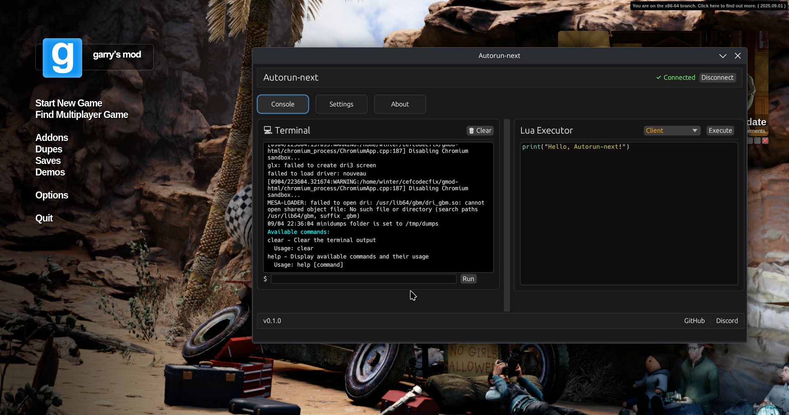

# Autorun-next

This is [Autorun](https://github.com/Vurv78/Autorun-rs) for the next generation, with two main goals in mind:

- Being 100% undetectable, even by the smallest means.
    - The library now injects itself automatically, no file or configuration as a menu plugin which is easily discoverable.
- Having first class Linux support
    - This was built from the ground up with Linux support in mind. Windows support will come later.

This does not intend to be backwards compatible with the original Autorun, but it should feel familiar.



## File Structure

**⚠️ Since Autorun-next is based around a main program instead of the injected library, files are stored relative to the executable.**

_This is just the planned file structure. Nothing is implemented yet._

```lua
./
├── your_binary
└── autorun/
    ├── plugins/
    │   └── foo-plugin/
    │       ├── src/
    │       │   ├── init.lua -- Runs for each time you join a server
    │       │   ├── hook.lua -- Runs for each file that is run in a server
    │       │   └── menu.lua -- Runs one time upon game launch in the menu
    │       └── plugin.toml
    └── settings.toml
```

### Differences with Autorun-rs

- No more top level files
    - Everything is a plugin for simplicity.

- No more /lua_dumps
    - This is going to be handled via a plugin rather than be an explicit part of Autorun for simplicity and modularity.

## Building

Use `just build` to build the project.

If you don't do this, build order might be messed up which will cause the ui to fail to build as it depends on the library.
